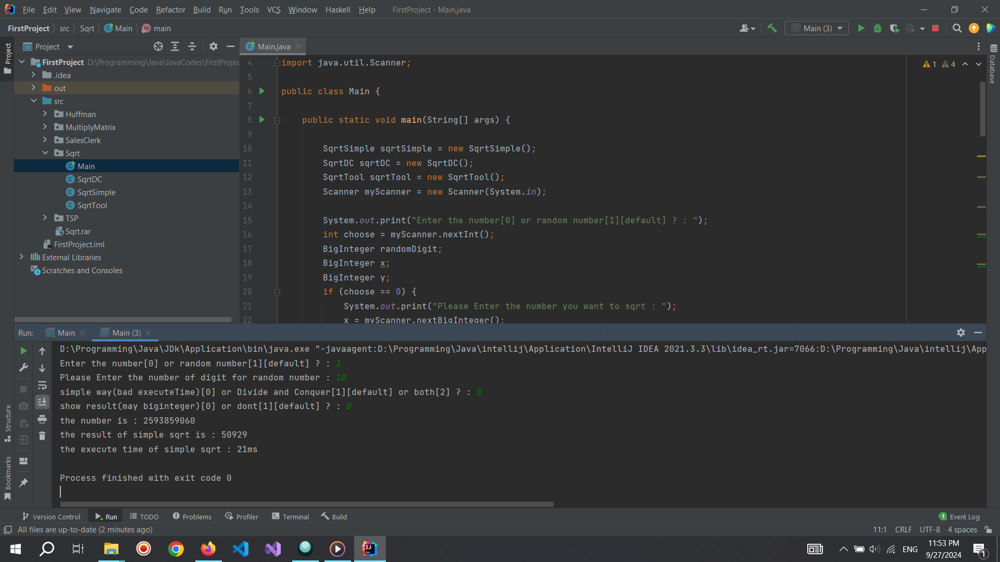
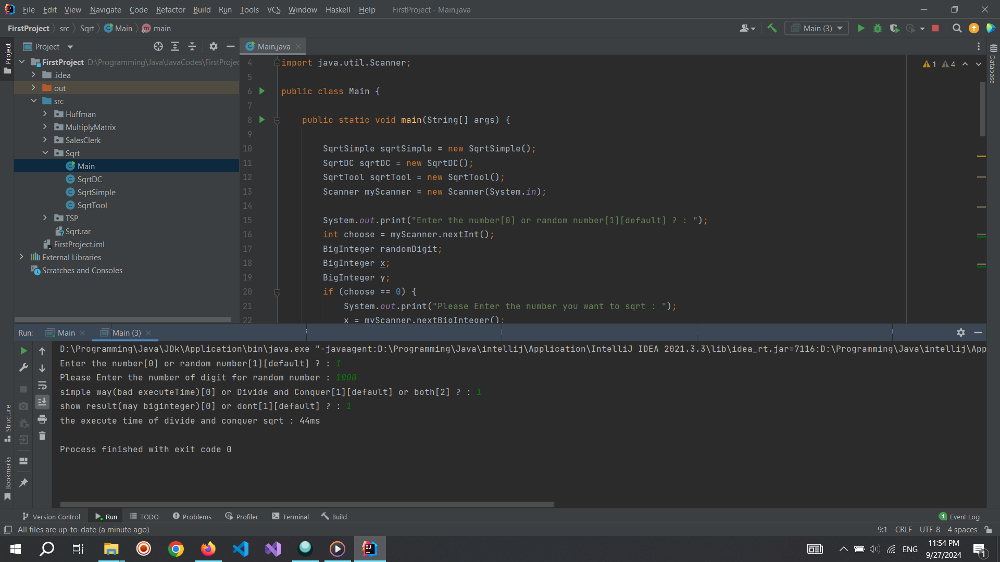

# Square-root-DC
Calculating Square root with divide and conquer method

## Simple way :

time complexity : O(n)

## Divide and Conqure way :

time complexity : O(log₂ N)

## Compare simple way and divide and conqure :

### Theory :
Time complexity of Simple way : O(n)
Time complexity of Divide and Conqure way : O(log₂ N)

### Act :
Time complexity of Simple way For 10 digit costs 21ms
Time complexity of Divide and Conqure way For 1000 digit costs 44ms
